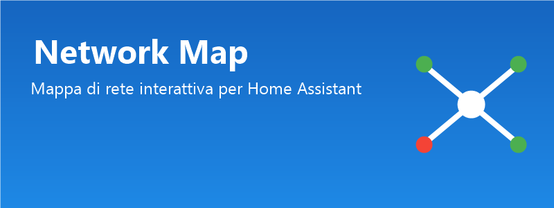

# Network Map - Custom Component per Home Assistant

Un'integrazione completa per Home Assistant che permette di creare una **mappa di rete interattiva**, monitorare lo stato online/offline dei dispositivi via ping e risolvere automaticamente gli IP dinamici tramite MAC address.

## Funzionalità

- ✅ **Aggiunta dispositivi** tramite interfaccia nativa Home Assistant (Config Flow)
- ✅ **Supporto IP statici**: ping ogni 60 secondi
- ✅ **Supporto IP dinamici**: risoluzione MAC → IP via tabella ARP
- ✅ **Tipi di dispositivo**: videocamera, NAS, switch, access point, router, server, generico
- ✅ **Card Lovelace grafica** con nodi trascinabili e persistenza delle posizioni
- ✅ **Entità `binary_sensor`** per ogni dispositivo con stato `on`/`off`

## Installazione

### HACS (raccomandato)

#### Integrazione (backend)

1. Vai su **HACS → Integrazioni**
2. Clicca su **⋮ → Repository personalizzati**
3. Aggiungi l'URL del repository GitHub di questa integrazione e seleziona categoria **Integrazione**
4. Cerca **Network Map** e installa
5. Riavvia Home Assistant

#### Card Lovelace (frontend)

1. Vai su **HACS → Frontend**
2. Clicca su **⋮ → Repository personalizzati**
3. Aggiungi l'URL del repository della card e seleziona categoria **Lovelace**
4. Cerca **Network Map Card** e installa

Dopo l'installazione di entrambi, aggiungi l'integrazione da **Impostazioni → Dispositivi e servizi → Aggiungi integrazione → Network Map**.

### Manuale

1. Copia la cartella `custom_components/network_map` nella tua configurazione Home Assistant (`<config>/custom_components/network_map`).
2. Copia il file `www/network-map-card.js` in `<config>/www/network-map-card.js`.
3. Riavvia Home Assistant.
4. Aggiungi la risorsa JS alla dashboard:
   - Vai su **Impostazioni → Dashboard → ⋮ (menu) → Risorse**
   - Clicca **Aggiungi risorsa**
   - URL: `/local/network-map-card.js`
   - Tipo: **JavaScript Module**
5. Vai su **Impostazioni → Dispositivi e servizi → Aggiungi integrazione** e cerca **Network Map**.
6. Inserisci il primo dispositivo e salva.
7. Per aggiungere altri dispositivi, clicca su **Opzioni** dalla scheda integrazione.

## Configurazione Card Lovelace

Se hai installato la card tramite HACS, la risorsa JS viene aggiunta automaticamente. Se l'hai installata manualmente, segui le istruzioni sopra per aggiungere `/local/network-map-card.js` alle risorse.

Aggiungi una card manuale alla tua dashboard:

```yaml
type: custom:network-map-card
title: La Mia Rete
height: 600
```

## Aggiungere un dispositivo

Dopo aver creato l'integrazione, puoi aggiungere dispositivi in qualsiasi momento:

1. Vai su **Impostazioni → Dispositivi e servizi → Network Map**
2. Clicca su **Configura** (o **Opzioni**)
3. Scegli **Aggiungi dispositivo**
4. Compila il modulo:
   - **Nome**: nome visualizzato
   - **Tipo**: categoria del dispositivo
   - **Indirizzo IP** (opzionale se inserisci il MAC)
   - **Indirizzo MAC** (opzionale se inserisci l'IP, utile per IP dinamici)
   - **Posizione X / Y**: coordinate iniziali sulla mappa

> **Nota**: almeno uno tra IP e MAC deve essere fornito.

## Come funziona il monitoraggio

- **IP statico**: ogni 60 secondi viene eseguito un `ping -c 1 -W 2 <ip>`.
- **Solo MAC**: il sistema legge `/proc/net/arp` ed esegue `ip neigh` per trovare l'IP attuale associato al MAC. Se trovato, esegue il ping. Se non trovato, il dispositivo risulta **offline**.

## Servizi

### `network_map.update_position`

Aggiorna le coordinate di un dispositivo sulla mappa (usato automaticamente dalla card quando trascini un nodo).

| Campo | Tipo | Descrizione |
|-------|------|-------------|
| `device_id` | string | ID univoco del dispositivo |
| `x` | float | Coordinata X |
| `y` | float | Coordinata Y |

## Struttura progetto

```
home-assistant-network-map/
├── custom_components/
│   └── network_map/
│       ├── __init__.py
│       ├── manifest.json
│       ├── config_flow.py
│       ├── const.py
│       ├── coordinator.py
│       ├── entity.py
│       └── binary_sensor.py
├── www/
│   └── network-map-card.js
└── README.md
```

## Requisiti

- Home Assistant OS / Supervised / Container (richiede accesso agli strumenti di sistema `ping` e `ip`)
- Funziona su qualsiasi istanza HA basata su Linux

## Licenza

MIT
